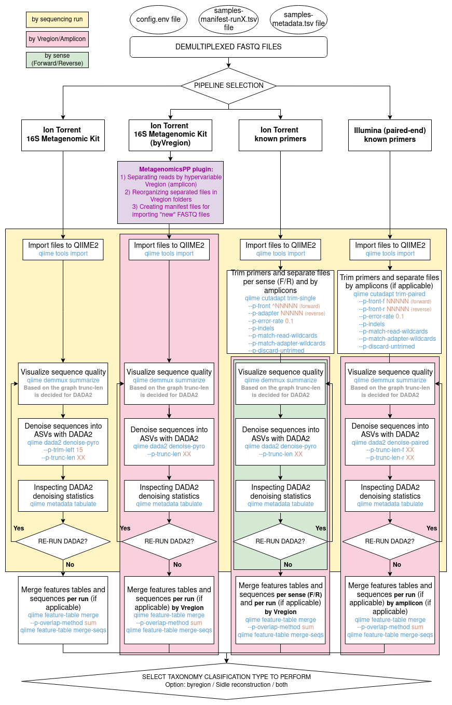
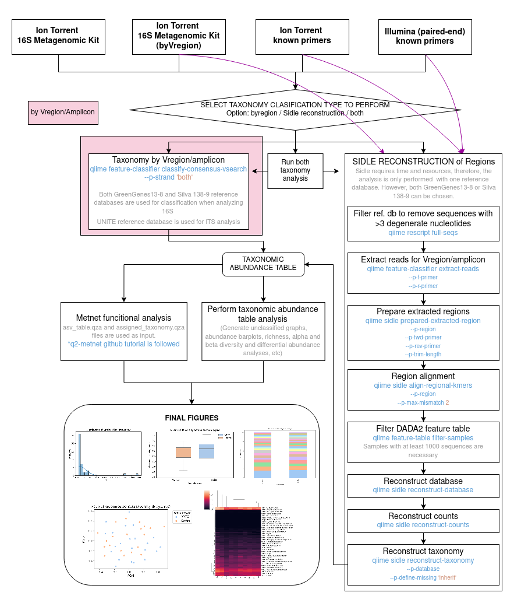
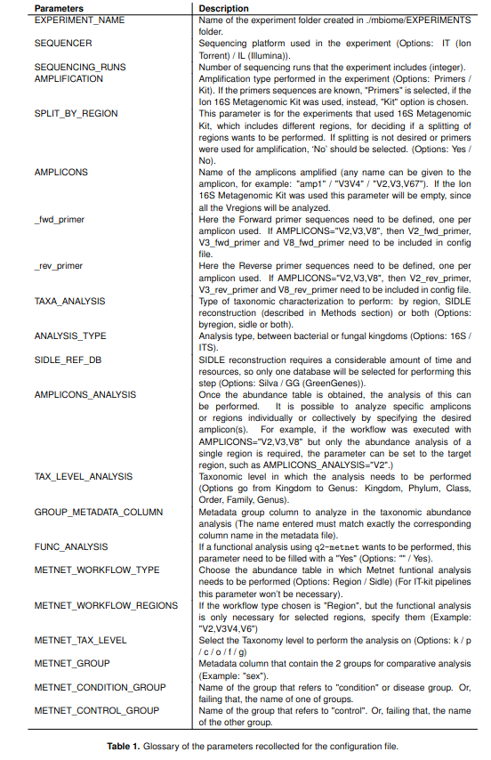

# mbiome

## MBIOME: A Comprehensive Amplicon Sequencing Analysis Workflow for everyone

MBIOME is a user-friendly and fully automated workflow designed to streamline the complete analysis of amplicon sequencing data using QIIME2. It supports both 16S (bacterial) and ITS (fungal) amplicon sequences, and is compatible with data generated from Ion Torrent and Illumina sequencing platforms.

## 🧬 MBIOME: A Comprehensive, Reproducible, and Open-source Workflow for Amplicon-based Microbiome Data Analysis

MBIOME is a user-friendly and fully automated workflow designed to streamline the complete analysis of amplicon sequencing data using QIIME2. It supports both 16S (bacterial) and ITS (fungal) amplicon sequences, and is compatible with data generated from Ion Torrent and Illumina sequencing platforms.

<!-- ### Simplified and Interactive:
The workflow is designed to be interactive, guiding users through the process with a series of simple questions about their sample processing. This approach eliminates the need for programming knowledge, making advanced bioinformatics accessible to everyone. -->

### ⚙️ Fully Automated

Once you provide the required input, the workflow takes care of the entire process — from the initial processing of raw FASTQ files to the generation of detailed downstream analyses and publication-ready outputs.

### 🧩 Customizable

The workflow is managed through a configuration file that defines all the experimental parameters. While the execution is fully automated, users retain full control to customize their analysis — selecting amplification methods, sequencing platforms, and analytical approaches according to their experimental design.

### 🌍 Versatile and Comprehensive

Whether working with 16S or ITS amplicon datasets, MBIOME is designed to handle diverse data types, ensuring robust and reproducible results across different sequencing technologies.

### 💻 Cross-Platform Compatibility

MBIOME accepts FASTQ files from both Ion Torrent and Illumina sequencing systems, providing flexibility and broad applicability for a wide range of microbiome research projects.

## Workflow diagram and steps: 




## Pre-requisites
This workflow is compatible with Linux operative system. Miniconda needs to be installed (explained later). 

## Getting Started
To get started, open computer's terminal and clone this repository. 

### Clone repository: 
1. Clone the repository in a folder: 
```shell
git clone https://github.com/MGorostidi/mbiome.git
```
2. Move to the folder where the repository has been created: 
```
cd mbiome
```

### Installing: 
1. Make sure Miniconda is installed in your computer (follow instructions in https://docs.anaconda.com/free/miniconda/)
2. Update conda:
```shell
conda update conda
```
3. Install wget:
```shell
conda install wget
```
4. Create Qiime2 environment:  
```shell
conda env create -f environment.yml
```

<!-- ```shell
conda env create -n qiime2-amplicon-2024.2 --file="https://data.qiime2.org/distro/amplicon/qiime2-amplicon-2024.2-py38-linux-conda.yml"
``` 
```shell
wget https://data.qiime2.org/distro/amplicon/qiime2-amplicon-2024.2-py38-linux-conda.yml
conda env create -n qiime2-amplicon-2024.2 --file qiime2-amplicon-2024.2-py38-linux-conda.yml
rm qiime2-amplicon-2024.2-py38-linux-conda.yml
```-->
5. Downloading MetagenomicsPP plugin by Thermofisher: 
MetagenomicsPP plugin will be included in mbiome, but if you don't see a folder inside Mbiome, called MetagenomicsPP, you should install it:
```shell
# From https://apps.thermofisher.com/apps/spa/#/publiclib/plugins , after loggin in in the Thermofisher account.
# 1) Log in (or Sign in) in Thermofisher.
# 2) Go to https://apps.thermofisher.com/apps/spa/#/publiclib/plugins 
# 3) Search for MetagenomicsPP and download it
# 4) Unzip the downloaded .zip folder
# 5) Move the MetagenomicsPP folder to the mbiome folder. 
```
<!-- 
6. Downloading and Installing Sidle for reconstruction: 
```shell
# # Downloading Sidle and installing Sidle: 
# # Tutorial: https://q2-sidle.readthedocs.io/en/latest/database_preparation.html
# # Activate your qiime2 environment: 
# conda activate qiime2-amplicon-2024.2
# conda install dask
# conda install -c conda-forge -c bioconda -c qiime2 -c defaults xmltodict
# # pip install git+https://github.com/bokulich-lab/RESCRIPt.git # IF RESCRIPT IS NOT INSTALLED IN YOUR QIIME2 ENVIRONMENT (Last versions normally include it)
# pip install git+https://github.com/jwdebelius/q2-sidle
# qiime dev refresh-cache
``` -->

<!-- 
7. Install Metnet for functional analysis: 
```shell
#From tutorial: https://github.com/PlanesLab/q2-metnet
conda activate qiime2-amplicon-2024.2
git clone https://github.com/PlanesLab/q2-metnet.git
cd q2-metnet/q2_metnet/
unzip data.zip
rm data.zip
cd ..
python setup.py install
qiime dev refresh-cache
``` 
-->

### Initial configuration: 
1. Run initialize_parameter.sh included in created mbiome folder:
<!-- 
Open initialize_parameters.sh and update the necessary variables: 
(1) the path to your mbiome project
(2) path to the conda.sh from Miniconda where it has been installed.
(3) the qiime2 version name that you have already installed
Now run the script. 
-->
```shell
bash initialize_parameters.sh
```

2. Download reference databases: 
- Green Genes DB and SILVA DB will be used for 16S characterization. The databases will be downloaded directly in the prepared .sh file. 
- For ITS characterization *instead*, UNITE database will be used. This *needs to be downloaded* prior running download_databases.sh file. 
2.1 
(1) Download UNITE from: https://doi.plutof.ut.ee/doi/10.15156/BIO/2959336<br>
(2) Move the .tar.gz to DATABASES folder<br>
(3) Once the .tar.gz file is saved, we can run the script: 
2.2
```shell
bash download_databases.sh
```
3. Import databases to Qiime2:<br>
(1) Since different versions of the databases can be downloaded, we need to write down the exact names of the files at the beginning of the import_databases.sh script.<br>
You will find the exact lines that you need to modify in the file.<br>
(2) Now we can run the file: 
```shell
bash import_databases.sh
```

## Running the workflow: 
In order to run an experiment, some initial files need to be prepared: 
0. Create a folder with your experiment name in EXPERIMENTS folder. Inside this, you need to add 3 files at least (the number will depend on the experiment's characteristics). You will find an example of each file in "EXAMPLE_FILES" folder:
1. A config.env file: Open the file and read carefully. This file collects all the information about the experiment. You will need to complete or change the parameters (you will see that there is an explanation of each parameter, that starts with a #. Then the name of the parameters appears in capital letters; that one is the variable you need to change). Here is a table about config file parameters: 




2. One samples-manifest-runXX.tsv file by run (see samples-manifest files in EXAMPLE_FILES and check important_notes file): The samples-manifest file includes the list of samples that you want to analyze. If the samples of your experiment were processed in different sequencing runs, you need to prepare a samples-manifest-runXXX.tsv for each run (ex: samples-manifest-run1.tsv / samples-manifest-run2.tsv / samples-manifest-run11.tsv)

3. One samples-metadata.tsv file (see samples-metadata files in EXAMPLE_FILES and check important_notes file): only one file for experiment is needed. Here all the metadata that you want to include about your samples will be added. The only column that must be added in all the experiments is the first one, the sample-id. Remember to use the same sample-id-s as in samples-manifest files. After that, you can add whatever information you want. Make sure to define the column type in the second row correctly. 


Once the 3 files are created, we can run the workflow:

Everything is integrated in an unique script, so you just need to run the following code in the Terminal of your computer (you should already be inside mbiome folder). 
There are some questions that would need to be answered interactively during the anaysis process:
```shell
bash mbiome
```


## Cite us: 

Microbiota modulation by teriflunomide therapy in people with multiple sclerosis: An observational case-control study. Moles, L., Otaegui-Chivite, A., Gorostidi-Aicua, M., Romarate, L., Mendiburu, I., Crespillo-Velasco, H., Álvarez de Arcaya, A., Ferreira, E., Arruti, M., Castillo-Triviño, T., & Otaegui, D. Neurotherapeutics. 2024;21(6):e00457. doi:  https://doi.org/10.1016/j.neurot.2024.e00457